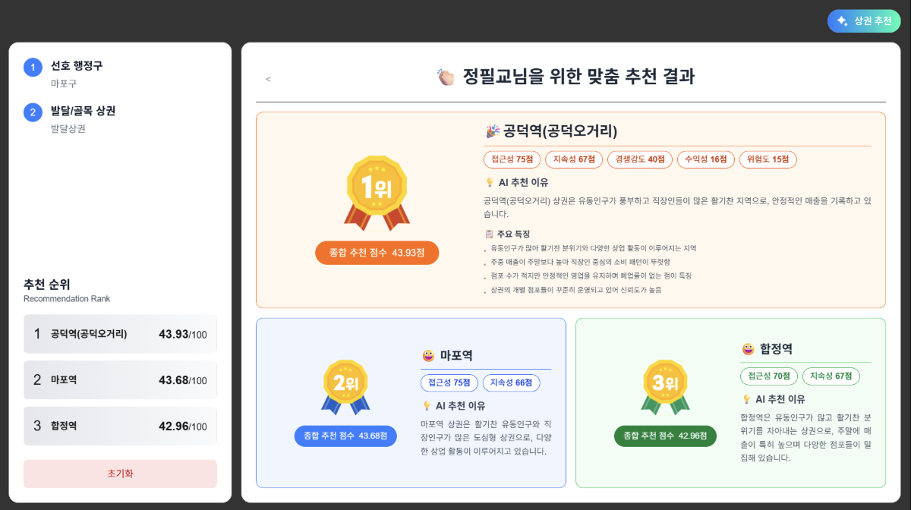
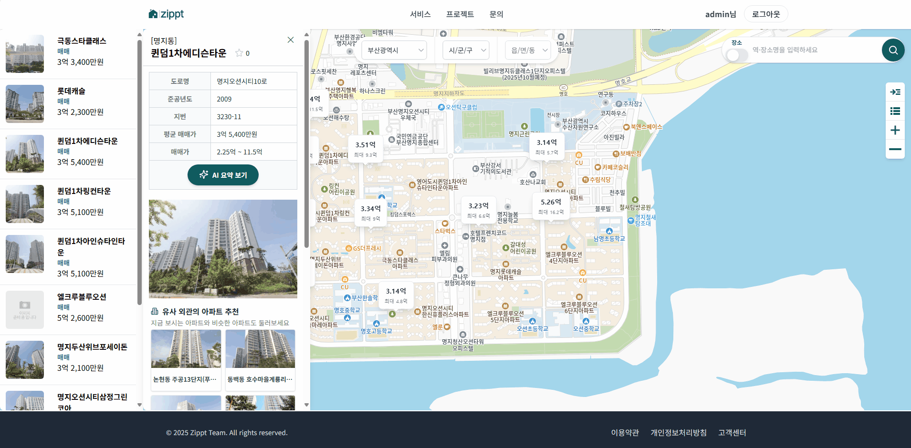

  

 

 

## 목적
- 실무에서 발생한 문제를 정리하고 개선 방향을 기록
- 업무와 자기계발을 통해 얻은 학습 내용을 구조화하여 축적
- 지속적인 성장을 위한 사고 방식과 실행 과정을 문서화

 

## 🛠️ 기술스택

  
  
  
  

   

  
  
  

   

  
  
  
  

   

  
  
  
  
  

   

  
  
  
  
  

## 🔄 현재 진행 중인 Project
|  |
| --- |
| ***⏰ 시계열 DB 기반 설비 데이터 수집·분석 미니 프로젝트***  [  Time-Series-Lab GitHub 바로가기](hhttps://github.com/Jihoons-Growthlab/Time-Series-Lab)

## 📘 SSAFY Project
|  |
| --- |
| ***🏙️ InSite (상권 데이터 분석 플랫폼)***  [  InSite GitHub 바로가기](https://github.com/Jihoons-Growthlab/InSiteInSSAFY)
공공 데이터를 기반으로 상권을 분석하고, 예비 창업자에게 인사이트를 제공하는 데이터 분석 플랫폼입니다. 
||
| ***🥊 Demolition King (실시간 인터랙션 게임)***    [철거왕 GitHub 바로가기](https://github.com/Jihoons-Growthlab/DemolitionKingInSSAFY)
MediaPipe 기반 모션 인식 기술을 활용해, 실제 복싱 동작으로 상호작용하며 채팅·랭킹 경쟁을 즐길 수 있는 레트로 스타일 멀티플레이 게임
||
| ***🤖 Gippt (AI 기반 부동산 보조 서비스)***  [Zippt GitHub 바로가기](https://github.com/Jihoons-Growthlab/GipptInSSAFY)
카카오맵 기반 UI에서 아파트 실거래, 리뷰, 상권, 뉴스까지 한눈에 확인하고 AI 기반 요약 및 유사 단지 추천까지 제공하는 부동산 플랫폼입니다.

